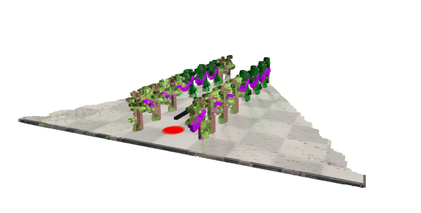

# Agricultural 3D Reconstruction using ROS2 and Open3D



## Overview

This project presents a complete pipeline for the 3D reconstruction of an agricultural environment using a mobile robot equipped with an RGB-D camera.

The objective is to generate a digital representation of an agricultural field by combining robot navigation, RGB-D sensing and 3D point cloud reconstruction techniques.

The proposed approach consists of two main stages:

- Data acquisition;
- 3D reconstruction.

---

# Pipeline

The complete pipeline is composed of two main phases.

## Data Acquisition

A mobile robot equipped with an RGB-D camera autonomously navigates through the agricultural environment while collecting:

- RGB images;
- Depth maps;
- Robot poses;
- Camera intrinsic parameters.

The acquired data are stored into a structured dataset called reconstruction_data.

## 3D Reconstruction

The reconstruction algorithm:

- loads the acquired dataset;
- generates a point cloud for each frame;
- transforms every point cloud into the global reference frame;
- fuses all point clouds;
- removes noise;
- generates the final 3D reconstruction.

```
RGB-D Camera
      |
      v
Data Acquisition
      |
      v
Dataset Generation
      |
      v
Point Cloud Creation
      |
      v
Point Cloud Fusion
      |
      v
Final 3D Reconstruction
```

---

# Repository Structure

```
Agricultural-3D-Reconstruction/
│
├── README.md
├── LICENSE
├── requirements.txt
│
├── acquisition/
│   └── data_collector.py
│
├── reconstruction/
│   └── reconstruction3D.py
│
├── example_output/
│   ├── acquisition_output_example/
│   │   └── reconstruction_data/
│   │       ├── color/
│   │       ├── depth/
│   │       ├── poses/
│   │       └── camera_intrinsics.json
│   │
│   └── reconstruction_output_example/
│       └── fusion_final.ply
│
├── images/
│
└── docs/
```

## Folder Description

### acquisition/

Contains the ROS2 node responsible for robot navigation and RGB-D data acquisition.

### reconstruction/

Contains the Open3D reconstruction algorithm that generates the final 3D point cloud.

### example_output/

Provides example outputs generated by the project.

#### acquisition_output_example/

Contains an example of the generated dataset:

- RGB images;
- Depth maps;
- Robot poses;
- Camera intrinsic parameters.

#### reconstruction_output_example/

Contains an example of the final reconstructed point cloud:
```
fusion_final.ply
```

### images/

Contains figures and screenshots used in the documentation.

### docs/

Contains additional project documentation and presentation material.

---

# Requirements

## Python

Python 3.x

## Required Python packages

- numpy
- opencv-python
- open3d

Install the required packages using:

```bash
pip install -r requirements.txt
```

## Required ROS2 packages

- rclpy
- sensor_msgs
- geometry_msgs
- nav_msgs
- cv_bridge

---

# Data Acquisition

The data acquisition stage is implemented by the ROS2 node:
```
data_collector.py
```

The node is designed for a LIMO mobile robot equipped with an Orbbec RGB-D camera operating in a simulated agricultural environment. We used a CoppeliaSim scene. 

Its main purpose is to autonomously drive the robot along a straight trajectory through the crop row while simultaneously collecting the data required for the 3D reconstruction process.

The node performs two main tasks.

## Robot Navigation

The robot autonomously moves through the agricultural field following a straight path towards a predefined target position.

The control algorithm:

- computes the direction of the target;
- aligns the robot with the desired trajectory;
- moves the robot forward along the crop row;
- continuously updates the robot orientation;
- stops when the destination is reached.

## Data Collection

During navigation, the node simultaneously acquires:

- RGB images from the Orbbec RGB-D camera;
- depth maps;
- robot poses obtained from odometry.

To reduce redundant information, one frame is stored every three control loop iterations.

The camera intrinsic parameters are also saved and later used during the 3D reconstruction stage.

---

# Dataset Structure

The acquisition process generates the following dataset:

```
reconstruction_data/

├── color/
├── depth/
├── poses/
└── camera_intrinsics.json
```

## color

RGB images acquired by the RGB-D camera.

## depth

Depth maps.

## poses

Robot poses stored as 4×4 transformation matrices.

## camera_intrinsics.json

Camera intrinsic parameters:

- image width;
- image height;
- focal lengths;
- principal point coordinates.

---

# 3D Reconstruction

The reconstruction stage is implemented in:

```
reconstruction3D.py
```

For each acquired frame, the algorithm:

1. Loads RGB image, depth map and robot pose;
2. Creates an RGB-D image;
3. Generates a local point cloud;
4. Transforms the point cloud from the camera frame to the robot frame;
5. Transforms the point cloud into the global reference frame;
6. Adds the point cloud to the global reconstruction.

After processing all frames:

- voxel downsampling is applied;
- statistical outlier removal is performed;
- the final point cloud is generated.

---

# Running the Project

## Step 1

Prepare a LIMO mobile robot equipped with an Orbbec RGB-D camera.

The data acquisition node is designed to operate on a LIMO platform and requires the following data streams:

- RGB images;
- depth maps;
- robot odometry.

In this project, the proposed pipeline was validated in a CoppeliaSim agricultural scenario developed during the laboratory activities. The simulation environment consists of:

- a LIMO mobile robot;
- an agricultural field composed of two parallel crop rows simulated with CoppeliaSim.

However, the acquisition node is not tied to the simulation and can be executed on a real LIMO robot provided that the required sensor topics are available.

## Step 2

Run the data acquisition node.

```bash
python3 acquisition/data_collector.py
```

The node automatically generates the dataset.

## Step 3

Run the reconstruction algorithm.

```bash
python3 reconstruction/reconstruction3D.py
```

## Step 4

The final point cloud is generated as:

```
fusion_final.ply
```

and displayed using Open3D.

---

# Output

The final output of the project is a colored 3D point cloud representing the agricultural environment.

The generated point cloud can be:

- visualized with Open3D;
- exported for further processing;
- used for agricultural analysis.

---

# Applications

Potential applications include:

- Precision agriculture;
- Digital twins;
- Crop monitoring;
- Biomass estimation;
- Environmental mapping;
- Autonomous navigation.

---

# Authors

**Fabiana Maria Placchi**

**Giada Butticè**

University Project

Academic Year 2025/2026

